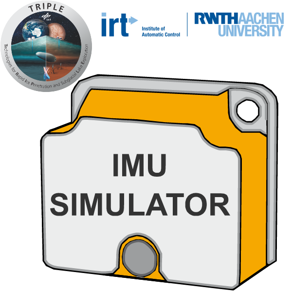

# IRT C++/ROS 2 IMU-Simulator

[](https://opensource.org/licenses/BSD-3-Clause)



<!--- protected region package header begins -->
**Author:**
- Maximilian Nitsch <m.nitsch@irt.rwth-aachen.de>

**Affiliation:** Institute of Automatic Control - RWTH Aachen University

**Maintainer:**
  - Maximilian Nitsch <m.nitsch@irt.rwth-aachen.de>
<!--- protected region package header ends -->

## Description
This project provides a high-fidelity IMU simulator written in C++.

The simulator implements the following features:
- Accelerometer and gyroscope measurement simulation
- WELMEC gravity model (accelerometer)
- WGS84 Earth angular velocity model (gyroscope)
- Transport rate angular velocity model (gyroscope)
- Turn-on bias
- Scaling errors
- Misalignment and orthogonality errors
- Stochastic noise (colored/non-white noise)
  - Velocity/angular random walk
  - Bias instability
  - Acceleration/rate random walk
- Saturation
- Quantization errors
- All parameters for an IMU can be configured in a YAML file
- All models and effects can be enabled/disabled separately

An example config from real data of a STIM300 IMU is provided.

MATLAB scripts are provided to extract the stochastic noise components using Allan variance analysis.
For this, you must provide a long-term (minimum six hours) dataset of acceleration/gyroscope measurements.
The IMU must be static, temperature- and vibration-compensated during the recording.

## Table of Contents

- [Dependencies](#dependencies)
- [Installation](#installation)
- [Usage](#usage)
- [ROS 2 Nodes](#ros-2-nodes)
  - [Publisher Node](#publisher-node)
  - [Subscriber Node](#subscriber-node)
- [Coding Guidelines](#coding-guidelines)
- [References](#references)
- [Contributing](#contributing)
- [License](#license)

# Dependencies

This project depends on the following literature and libraries:

- **Eigen3**: Eigen is a C++ template library for linear algebra: [Eigen website](https://eigen.tuxfamily.org/).
- **ROS 2 Humble**: ROS 2 is a set of software libraries and tools for building robot applications: [ROS 2 Installation page](https://docs.ros.org/en/humble/Installation.html)).


# Installation

To install the `imu_simulator_package`, you need to follow these steps:

1. **Install Eigen3**: Eigen3 is a dependency for your package. You can install it using your package manager. For example, on Ubuntu, you can install it using the following command:

    ```bash
    sudo apt-get install libeigen3-dev
    ```

2. **Install ROS 2 Humble**: Make sure you have ROS 2 (Humble) installed. You can follow the official installation instructions provided by ROS 2. Visit [ROS 2 Humble Installation page](https://docs.ros.org/en/humble/Installation.html) for detailed installation instructions tailored to your platform.

3. **Clone the Package**: Clone the package repository to your ROS 2 workspace. If you don't have a ROS 2 workspace yet, you can create one using the following commands:

    ```bash
    mkdir -p /path/to/ros2_workspace/src
    cd /path/to/ros2_workspace/src
    ```

    Now, clone the package repository:

    ```bash
    git clone <repository_url>
    ```

    Replace `<repository_url>` with the URL of your package repository.

4. **Build the Package**: Once the package is cloned, you must build it using colcon, the default build system for ROS 2. Navigate to your ROS 2 workspace and run the following command:

    ```bash
    cd /path/to/ros2_workspace
    colcon build
    ```

    This command will build all the packages in your workspace, including the newly added package.

5. **Source the Workspace**: After building the package, you need to source your ROS 2 workspace to make the package available in your ROS 2 environment. Run the following command:

    ```bash
    source /path/to/ros2_workspace/install/setup.bash
    ```

    Replace `/path/to/ros2_workspace` with the actual path to your ROS 2 workspace.

That's it! Your `imu_simulator_package` should now be installed along with its dependencies and ready to use in your ROS 2 environment.

## Usage

1. **Configure your YAML file** for your IMU or use the default file.

2. **Start the IMU simulator** with the launch file:
    ```bash
    ros2 launch imu_simulator_package imu_simulator.launch.py
    ```
  The IMU simulator prints your settings and waits for a ground truth odometry message.

3. **Provide an odometry publisher** from you vehicle simulation.
  For testing, you can launch the odometry_test_publisher node:
    ```bash
    ros2 launch imu_simulator_package odometry_test_publisher.py
    ```

4. The IMU values should now be published.


**Important Usage Information**:
- The odometry message must be published with at least the IMU data rate/sample time.
- The message `/imu/diagnostic` will show `WARN` if the odometry rate is lower.
- If no odometry message is published, the message `/imu/diagnostic` will show `STALE`.
- If everything is correct, `/imu/diagnostic` will show `OK`. 

## ROS 2 Nodes

The IMU simulator node implements two publishers and subscribes to one topic.
ROS 2 services or actions are not provided.

### Publisher Node

This node publishes the following topics:

| Topic Name       | Message Type        | Description                        |
|------------------|---------------------|------------------------------------|
| `/nanoauv/sensor/navigation/imu/data`   | `sensor_msgs/Imu.msg`   | Publishes IMU sensor data.|
| `/nanoauv/sensor/navigation/imu/diagnostic`  | `diagnostic_msgs/DiagnosticStatus.msg` | Publishes the diagnostic status of the IMU data.

### Subscriber Node

This node subscribes to the following topics:

| Topic Name        | Message Type        | Description                        |
|-------------------|---------------------|------------------------------------|
| `/nanoauv/odometry`| `nav_msgs/Odometry.msg`| Subscribes to ground truth vehicle odometry.|

## Coding Guidelines

This project follows these coding guidelines:
- https://google.github.io/styleguide/cppguide.html
- http://docs.ros.org/en/humble/The-ROS2-Project/Contributing/Code-Style-Language-Versions.html 

## References

The IMU simulator implementation closely follows the work:
- J. A. Farrell, F. O. Silva, F. Rahman and J. Wendel, "Inertial Measurement Unit Error Modeling Tutorial: Inertial Navigation System State Estimation with Real-Time Sensor Calibration," in IEEE Control Systems Magazine, vol. 42, no. 6, pp. 40-66, Dec. 2022, [DOI: 10.1109/MCS.2022.3209059](https://doi.org/10.1109/MCS.2022.3209059).
- J. A. Farrell, "Aided Navigation Systems: GPS and High Rate Sensors," New York, NY, McGraw-Hill, 552 pages, 2008.

The MATLAB scripts are in parts taken from:
- [AV-MATLAB-SW](https://github.com/jaffarrell/AV-Matlab-SW)

## Contributing

If you want to contribute to the project, see the [CONTRIBUTING](CONTRIBUTING) file for details.

## License

This project is licensed under the BSD-3-Clause License. See the [LICENSE](LICENSE) file for details.

